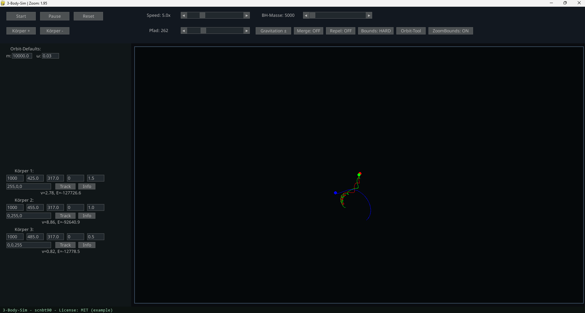
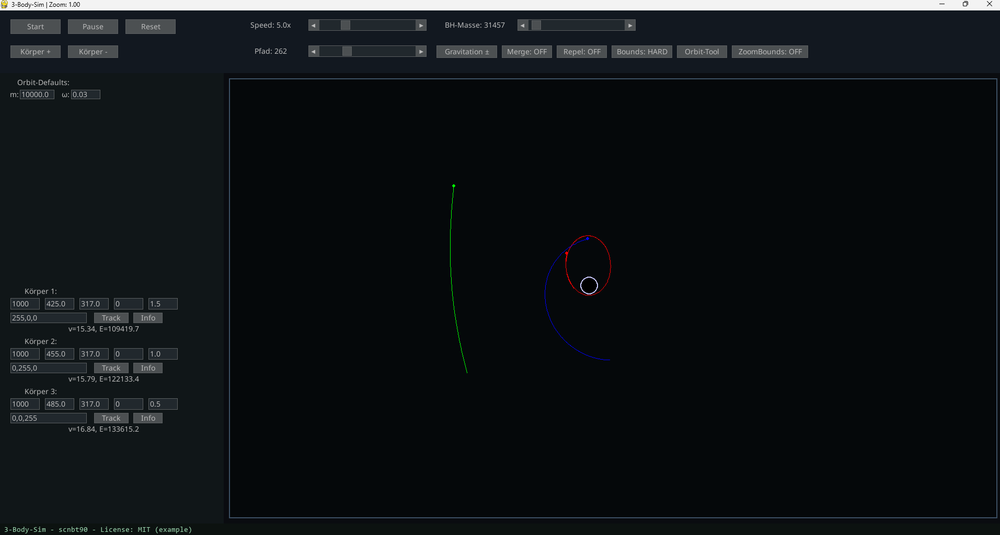
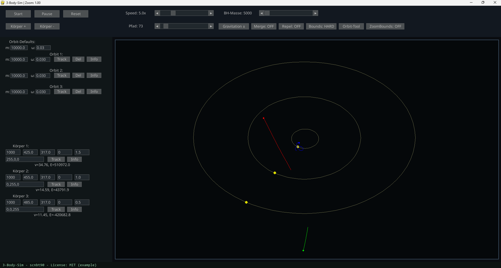
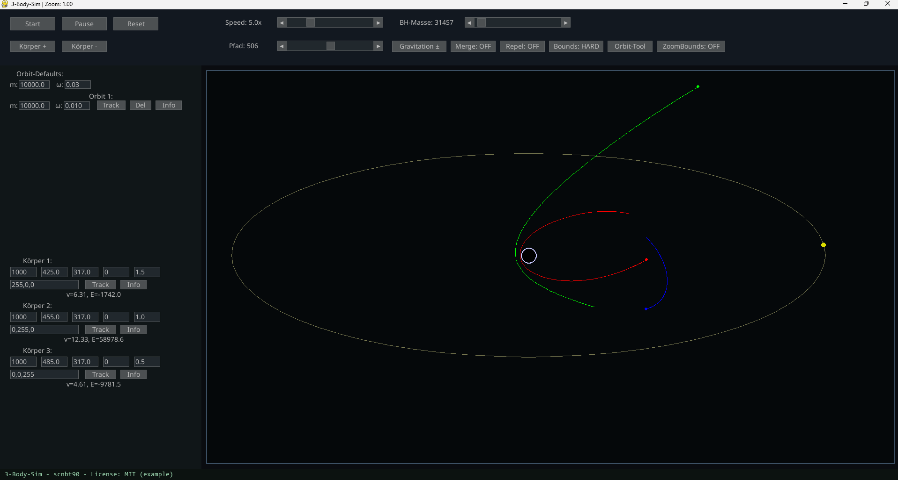

# 🪐 3-Body-Sim – Interactive N-Body / 3-Body Simulation

Interaktive Gravitationssimulation mit Körpern, Orbits, Schwarzem Loch, Tracking und einer Vielzahl physikalischer Einstellungen.



---

## ✨ Features

### 🌌 N-Body Physics

* Newtonsche Gravitationsphysik
* Geschwindigkeit & Energie pro Körper
* Merge-Modus (Kollision → Fusion)
* Repel-Modus (Abstoßung)
* Individuelle Pfadlängen
* Live-Parameterbearbeitung für alle Körper

---

### 🕳️ Schwarze Löcher



* Massive Zentralkörper
* Einstellbare Masse
* Starker Einfluss auf alle Objekte
* Visuell hervorgehoben

---

### 🎨 Orbit-Tool (Orbit-Editor)



* Erstelle Ellipsen/Kreisbahnen mit zwei Klicks
* **Live-Vorschau**, bevor der Orbit gesetzt wird
* Jeder Orbit hat eigene Parameter
* Orbits üben Gravitation auf Körper aus
* Orbit-Aktionen:
  **Track**, **Delete**, **Info**

---

### 🪐 Multi-Orbit Systeme



Erstelle komplexe Planetensysteme mit mehreren Orbits, ähnlich echten Sonnensystemen.

---

## ⚙️ Randbedingungen (Bounds)

| Modus      | Verhalten                          |
| ---------- | ---------------------------------- |
| **HARD**   | Körper prallen am Rand ab          |
| **SOFT**   | Körper verschwinden außerhalb      |
| **PORTAL** | Teleport: links raus → rechts rein |

Zusätzlich:
**ZoomBounds ON** – Zoom verändert den Simulationsrand dynamisch.

---

## 🎮 Bedienung & Tools

### Simulation

* Start / Pause / Reset
* Körper hinzufügen/entfernen
* Geschwindigkeit
* Pfad-Länge
* Black-Hole-Masse
* Gravitation ±
* Merge-Modus
* Repel-Modus
* Bounds-Modus
* ZoomBounds

### Orbit-Tool Workflow

1. Orbit-Tool aktivieren
2. Erster Klick → Mittelpunkt
3. Live-Vorschau (Ellipse)
4. Zweiter Klick → Orbit wird gesetzt
5. Orbit-UI:

   * **Track** (zentrierte Kameraverfolgung)
   * **Delete**
   * **Info** (v & E)

---

## 🧩 Installation

Benötigt:

* Python 3.10+
* pygame-ce
* pygame_gui

Installation:

```bash
pip install pygame-ce pygame_gui
```

Start:

```bash
python main2.py
```

---

## 📁 Projektstruktur

```
.
├── main2.py
├── modules/
│   ├── body.py
│   ├── orbit_body.py
│   ├── camera.py
├── screenshots/
│   ├── 3-Body-Problem.png
│   ├── Black-Hole.png
│   ├── BlackHole_Orbit.png
│   ├── Orbit-Tool.png
└── README.md
```

---

## 📜 Lizenz

MIT License – (C) 2025 scnbt90

---

## ⭐ Ideen für zukünftige Features

* GIF/Video-Recorder
* Szenen speichern & laden
* Velocity-/Force-Vektoren
* Ereignis-Trigger (z. B. Collision Listener)
* Multi-Black-Hole Systeme
